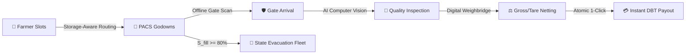

# 🌾 e-Kisan Krishi Samridhi — User & Operations Handbook
**Smart Storage-Aware Procurement, AI Quality Inspection & Offline-Resilient Supply Chain Platform**  
*SIH Problem Statement: PS 26032 | Primary Agricultural Credit Societies (PACS) & Department of Consumer Affairs (DOCA)*

---

## 📑 Table of Contents
1. [Platform Overview & Core Innovations](#1-platform-overview--core-innovations)
2. [Quick Start: Running the Platform](#2-quick-start-running-the-platform)
3. [Global Controls & Top Navigation](#3-global-controls--top-navigation)
4. [Module 1: Farmer Portal](#4-module-1-farmer-portal)
   - [Smart Slot Booking (Landholding vs Exact Weight)](#41-smart-slot-booking)
   - [Multi-Tranche Capping (>50 Quintals)](#42-multi-tranche-capping)
   - [Live Digital Token Tracker (5-Stage Pipeline)](#43-live-digital-token-tracker)
   - [AI Moisture & Quality Pre-Check](#44-ai-moisture--quality-pre-check)
   - [Procurement History & Digital Receipts](#45-procurement-history--digital-receipts)
5. [Module 2: Gatekeeper Portal (Offline-Resilient)](#5-module-2-gatekeeper-portal-offline-resilient)
   - [Gate QR Scanner & Manual Verification](#51-gate-qr-scanner--manual-verification)
   - [Offline Blackout Simulation & IndexedDB Sync](#52-offline-blackout-simulation--indexeddb-sync)
6. [Module 3: PACS Center Quality & Weighbridge Desk](#6-module-3-pacs-center-quality--weighbridge-desk)
   - [Real-Time Scheduled Pipeline & Token Tracker](#61-real-time-scheduled-pipeline--token-tracker)
   - [AI Quality Analysis & Inspector Override](#62-ai-quality-analysis--inspector-override)
   - [Weighbridge Gross/Tare & Tolerance Validation](#63-weighbridge-grosstare--tolerance-validation)
   - [Atomic 1-Click Fulfillment & Instant DBT Payout](#64-atomic-1-click-fulfillment--instant-dbt-payout)
7. [Module 4: District Admin & DOCA Command Center](#7-module-4-district-admin--doca-command-center)
   - [Real-Time Storage Saturation Gauges ($S_{fill}$)](#71-real-time-storage-saturation-gauges-s_fill)
   - [Predictive Evacuation & Fleet Dispatch ($S_{fill} \ge 80\%$)](#72-predictive-evacuation--fleet-dispatch-s_fill-ge-80)
   - [Smallholder 40% Equity Quota Engine](#73-smallholder-40-equity-quota-engine)
   - [System Intelligence & Engine Audits](#74-system-intelligence--engine-audits)
8. [Module 5: Hindi Voice IVR / Feature-Phone Simulator](#8-module-5-hindi-voice-ivr--feature-phone-simulator)
9. [Troubleshooting & Emergency Workflows](#9-troubleshooting--emergency-workflows)

---

## 1. Platform Overview & Core Innovations

The **e-Kisan Krishi Samridhi** platform eliminates long Mandi queues, prevents grain spoilage, and guarantees fair, equitable MSP procurement through four breakthrough mechanisms:



1. **Storage-Aware Admission Routing**: Slots are dynamically governed by live godown storage saturation ($S_{fill} = \frac{\text{Stock} + \text{Booked}}{\text{Capacity}}$). Centers lock at $\ge 95\%$ to prevent yard gridlock and auto-reroute to the nearest available PACS.
2. **Smallholder 40% Equity Quota**: Automatically reserves $40\%$ of daily capacity for marginal/smallholder farmers ($\le 2$ hectares / $5$ acres), preventing large commercial farmers from exhausting booking quotas.
3. **50Q Multi-Tranche Protection**: Large crop loads ($>50$ Quintals) are automatically broken down into staggered multi-day tranches so small farmers are never squeezed out.
4. **Pre-Trip AI Quality Inspection**: Computer vision estimates grain moisture and foreign matter from a smartphone photo before the farmer travels, preventing gate turnaways.
5. **Zero-Loss Offline Resilience**: Gatekeeper terminals function during total rural network blackout using IndexedDB client queuing and idempotent SHA-256 state replay.

---

## 2. Quick Start: Running the Platform

### Prerequisites
- Python 3.9+ installed
- Web browser (Chrome, Edge, Firefox, Safari)

### Installation & Launch
1. Open PowerShell or Terminal in the project root:
   ```bash
   cd c:\Users\Piyush\Downloads\SIH
   ```
2. Start the high-performance FastAPI server:
   ```bash
   python -m uvicorn app.main:app --host 0.0.0.0 --port 8000 --reload
   ```
3. Open the web application:
   - **Local Browser**: `http://127.0.0.1:8000`
   - **On Smartphones on the same Wi-Fi**: `http://<YOUR_COMPUTER_IP>:8000`

---

## 3. Global Controls & Top Navigation

The top industrial glass-panel header provides instant role switching and system diagnostics:

```
[🌾 e-Kisan Krishi Samridhi]  [🌾 Farmer] [🛡️ Gatekeeper] [⚖️ PACS Quality & Weigh] [📊 Admin] [📞 Voice IVR]  [Offline Toggle] [🌐 हिन्दी/English]
```

- **Role Switcher**: Click or tap any role pill (`Farmer`, `Gatekeeper`, `PACS Quality & Weigh`, `Admin Command`, `Hindi Voice IVR`). On mobile screens, slide horizontally across the pills with your thumb.
- **Simulate Offline Switch**: Toggle the `Offline:` checkbox to simulate rural internet blackout. The badge changes from 🟢 `Online` to 🔴 `Offline (Simulated)`.
- **Language Selector**: Tap `🌐 हिन्दी` to instantly switch the entire interface into Hindi or English.

---

## 4. Module 1: Farmer Portal

The Farmer Portal is designed for mobile field usability. It consists of 4 sub-tabs:

### 4.1. Smart Slot Booking
1. Enter your **10-digit mobile number** (e.g., `9876543210` for demo smallholder *Ramesh Kumar*).
2. Select your **Crop** (Wheat, Chana, Tur/Arhar, Mustard, Paddy).
3. **Choose Quantity Input Method** from the dropdown:
   - **Option A — Landholding Area (Acres)**: Enter acreage (e.g. `2.5`). The system calculates estimated yield using historical agro-yield formulas ($16.0\text{ Q/acre}$).
   - **Option B — Exact Crop Weight (Quintals)**: Directly enter your measured quintals (e.g. `35.0 Q`). The system validates against land caps and calculates gross MSP payout.
4. Select your preferred **Procurement Center (PACS Godown)**:
   - Each card displays live storage saturation, current stock, and a **dynamic glowing storage meter**.
   - If a center is full ($\ge 95\%$), the card automatically locks and suggests the nearest alternative center with distance and available capacity.
5. Select your vehicle type (**Tractor Trolley**, **Mini Truck / Pickup**, or **Bullock Cart / Tempo**).
6. Click **"Confirm Booking & Generate Digital Token"**.

### 4.2. Multi-Tranche Capping
- **Loads $\le 50\text{ Q}$**: Instant single-day guaranteed 2-hour arrival window (e.g. `08:00 AM - 10:00 AM`).
- **Loads $> 50\text{ Q}$** (e.g. $80\text{ Q}$): Automatically split into Tranche 1 ($50\text{ Q}$ on Day 1) and Tranche 2 ($30\text{ Q}$ on Day 3). Both tokens are generated simultaneously with guaranteed arrival windows.

### 4.3. Live Digital Token Tracker
- Switch to the **"Track My Token"** sub-tab or enter any Token ID (e.g., `TK-78401`).
- Displays a high-contrast **5-Stage Live Digital Stepper**:
  $$\text{Slot Confirmed} \longrightarrow \text{Gate Arrival} \longrightarrow \text{AI Quality Tested} \longrightarrow \text{Weighbridge Complete} \longrightarrow \text{DBT Payout Dispatched}$$
- Displays a scannable **QR Code** for the gatekeeper to scan at the PACS entry.

### 4.4. AI Moisture & Quality Pre-Check
- Upload or capture a grain photo before traveling to the PACS center.
- Click **"Analyze Grain Quality with AI"** or choose a preset demo grain sample:
  - 🟢 **Grade A ($<14.5\%$ Moisture)**: Safe for immediate procurement. Recommendation: *Proceed to PACS Center*.
  - 🟡 **Grade B ($14.5\% - 16.5\%$ Moisture)**: Acceptable with standard refraction or recommended 24h sun-drying.
  - 🔴 **Rejected ($>16.5\%$ Moisture)**: High spoilage risk. Direct advisory provided: *Sun-dry grain for 2-3 days before visiting PACS*.

### 4.5. Procurement History & Digital Receipts
- View past transactions, official government receipt numbers (`REC-XXXXX`), moisture readings, and net DBT bank disbursement amounts with breakdown.

---

## 5. Module 2: Gatekeeper Portal (Offline-Resilient)

Designed for security guards and weighbridge intake operators at the PACS facility gate.

### 5.1. Gate QR Scanner & Manual Verification
1. Enter or scan the farmer's **Token Code** (e.g. `TK-78401` or tap `📷 Scan TK-78401`).
2. The system verifies:
   - Farmer Identity, Village & Phone Number.
   - Allocated Crop & Weight.
   - Guaranteed 2-Hour Arrival Slot.
3. Confirm or update the vehicle's **Tractor Number** (e.g. `UP-65-AB-1234`).
4. Click **"✅ Approve Gate Entry & Check-In Farmer"**.

### 5.2. Offline Blackout Simulation & IndexedDB Sync
1. Turn on **"Simulate Offline"** in the top header.
2. Check-in a token. The terminal instantly records the check-in to **IndexedDB local storage** and displays a warning badge: `Pending Sync`.
3. The farmer is approved without delay, and the gate barrier opens.
4. Turn off **"Simulate Offline"**. The sync engine automatically pushes queued transactions to the central database without data collision or token duplication.

---

## 6. Module 3: PACS Center Quality & Weighbridge Desk

The PACS Clerk terminal provides complete operational command over grain inspection, weighbridge measurement, and government DBT payout execution.

```
+-----------------------------------------------------------------------------------------+
|  PACS Clerk Desk: Rampur PACS Center                                [🔄 Refresh Pipeline]  |
|  [All Pipeline (6)] [📅 Upcoming Scheduled (2)] [🛡️ Yard Checked-In (2)] [🧾 Dispatched (2)]  |
|  [🔍 Search Token / Farmer / Phone...                                                 ]  |
+-----------------------------------------------------------------------------------------+
|  Token     | Farmer & Phone          | Crop & Qty | Scheduled Window | Live Status | Action     |
|  TK-78401  | Ramesh Kumar (9876...)  | Wheat 32Q  | 08:00 - 10:00 AM | Yard In     | [Inspect]  |
|  TK-78403  | Dinesh Yadav (9811...)  | Wheat 45Q  | 10:00 - 12:00 PM | Confirmed   | [Inspect]  |
+-----------------------------------------------------------------------------------------+
```

### 6.1. Real-Time Scheduled Pipeline & Token Tracker
- **No Gatekeeper Dependency**: The clerk always sees upcoming arrivals (`CONFIRMED`), their arrival window, vehicle, and volume.
- **Filter Pills**: Instantly toggle between `All`, `Upcoming Scheduled`, `Yard Checked-In`, `Quality Approved`, and `DBT Dispatched`.
- **Instant Search**: Type any name, phone, or token code into the search box for real-time table filtering.
- **Universal View Token**: Click **"🎫 View Token"** on any row to open the complete digital journey popup with status, test results, weighbridge log, and receipt.

### 6.2. Guided 3-Step Progressive Clerk Workflow
The PACS clerk inspection desk proceeds systematically through three sequential, non-jumping stages:

1. **Step 1: Arrival & Manifest Verification**:
   - Confirms farmer identity, mobile, registered village, crop variety, quota weight, and tractor number.
   - Advances live status node and moves to AI testing.

2. **Step 2: AI Quality Grading & Government Refraction Analysis**:
   - Evaluates multi-parameter metrics: Moisture %, Discoloration %, Foreign Matter %, Broken Grains %.
   - **Grade A ($<14.0\%$ Moisture, $<0.75\%$ Foreign Matter)**: 100% Full MSP payout ($0.0\%$ Refraction).
   - **Grade B ($14.1\% - 16.5\%$ Moisture / Foreign Matter $>0.75\%$)**: Standard government price refraction cuts calculated automatically.
   - **Manual Inspector Override**: Allows physical lab override with audit trail note.

3. **Step 3: Official Weighbridge & Instant DBT Payout Calculation**:
   - Records Gross Weight (Tractor + Crop) and Tare Weight (Empty Vehicle).
   - Computes Net Weight with automated $\pm 15\%$ tolerance check against booking estimate.
   - **Live Real-Time Financial Statement**: Shows Base MSP, Gross Amount, Itemized Government Quality Cuts, and Net DBT Payable to farmer *before* clicking authorize.

### 6.3. Government Quality Refraction (FAQ / FCI Norms)
The system strictly implements the official Government Price Refraction rules:
$$\text{Gross MSP Amount} = \text{Net Weight (Q)} \times \text{Crop MSP (₹/Q)}$$
$$\text{Moisture Cut} = \begin{cases} 0.0\%, & \text{if Moisture} \le 14.0\% \\ 0.75\%, & \text{if } 14.1\% \le \text{Moisture} \le 15.0\% \\ 1.50\%, & \text{if } 15.1\% \le \text{Moisture} \le 16.5\% \\ 3.00\%, & \text{if Moisture} > 16.5\% \text{ (Accepted on Override)} \end{cases}$$
$$\text{Foreign Matter Cut} = \begin{cases} 0.0\%, & \text{if Foreign Matter} \le 0.75\% \\ \text{Proportional } (1:1 \text{ deduction}), & \text{if Foreign Matter} > 0.75\% \end{cases}$$
$$\text{Discoloration Cut} = \begin{cases} 0.0\%, & \text{if Discoloration} \le 2.0\% \\ 0.5\%, & \text{if Discoloration} > 2.0\% \end{cases}$$
$$\text{Net DBT Bank Disbursement} = \text{Gross MSP} - \text{Total Quality Deductions}$$

### 6.4. Atomic 1-Click Fulfillment & Instant DBT Payout
1. Click **"✅ Accept Crop & Authorize Instant DBT Payout"**.
2. In a single atomic database transaction:
   - Finalizes official quality & weighbridge logs.
   - Updates PACS Godown stock and decrements booked capacity.
   - Generates official government receipt `REC-XXXXX` with transaction reference `TXN-DBT-...`.
   - Dispatches DBT payout directly to the farmer's Aadhaar-linked bank account.
   - Advances token status to `PAYMENT_DISPATCHED`.
   - Dispatches simulated SMS confirmation to the farmer.

---

## 7. Module 4: District Admin & DOCA Command Center

District Collectors, DOCA officials, and PACS Managers use this dashboard for district-wide procurement governance.

### 7.1. Real-Time Storage Saturation Gauges ($S_{fill}$)
- Displays all PACS Godowns across the district with capacity, current stock, incoming booked stock, and remaining headroom.
- Visual saturation meters:
  - 🟢 **Safe ($<80\%$)**: Normal admission.
  - 🟡 **Warning ($80\% - 94.9\%$)**: High saturation warning.
  - 🔴 **Critical ($\ge 95\%$)**: Admission locked; dynamic rerouting active.

### 7.2. Predictive Evacuation & Fleet Dispatch ($S_{fill} \ge 80\%$)
- When a godown reaches $80\%$ fill, the Predictive Evacuation Engine triggers an automated logistics alert.
- Click **"🚚 Dispatch X Trucks"** to simulate state buffer depot fleet deployment. The system atomically rebalances godown stock to prevent bottlenecks.

### 7.3. Smallholder 40% Equity Quota Engine
- Tracks real-time compliance with the $40\%$ smallholder quota ($2$ hectares / $5$ acres).
- Displays total farmers, total quintals procured, and total DBT payout disbursed in crores.

### 7.4. System Intelligence & Engine Audits
Explore live sub-audits under the intelligence panel:
- **Queue Intelligence**: 2-hour window distribution and queue smoothing metrics.
- **Storage Intelligence**: Real-time godown formulas and saturation percentages.
- **Equity Engine**: Marginal vs. Large farmer quota enforcement logs.
- **AI Quality Lab**: CV computer vision metrics and tolerance parameters.
- **Offline Sync Monitor**: SHA-256 state replay and idempotency logs.

---

## 8. Module 5: Hindi Voice IVR / Feature-Phone Simulator

Designed for non-smartphone and low-literacy farmers who cannot access the web app.

```
         +-----------------------------+
         |     e-KISAN IVR 1800-XXX    |
         | [1] गेहूं (Wheat)            |
         | [2] चना (Chana)             |
         | [3] तुअर / अरहर (Tur)       |
         | [4] धान (Paddy)             |
         +-----------------------------+
         |  [ 1 ]    [ 2 ]    [ 3 ]    |
         |  [ 4 ]    [ 5 ]    [ 6 ]    |
         |  [ 7 ]    [ 8 ]    [ 9 ]    |
         |  [ * ]    [ 0 ]    [ # ]    |
         +-----------------------------+
```

1. Click **"📞 Hindi Voice IVR"** in the top navigation.
2. Tap **"🔊 बोलें (Speak)"** to hear the conversational voice prompt in Hindi.
3. Use the interactive 12-key keypad:
   - **Step 1**: Press `1` for Wheat, `2` for Chana, `3` for Tur, `4` for Paddy.
   - **Step 2**: Enter landholding in acres (e.g. `3` followed by `#`).
   - **Step 3**: Select nearest PACS center (Press `1` for Rampur).
   - **Step 4**: Confirm booking (Press `1` to confirm).
4. The system confirms the guaranteed slot and sends an instant SMS with the token code.

---

## 9. Troubleshooting & Emergency Workflows

| Scenario | System Action | User Resolution |
| :--- | :--- | :--- |
| **PACS Center Storage $\ge 95\%$** | Center card turns red and locks booking button | Tap **"👉 Switch to [Alternative PACS]"** to book at the nearest available depot. |
| **Grain Moisture $>16.5\%$** | AI Quality pre-check marks crop `REJECTED` | Sun-dry grain on tarpaulin for 2-3 days until moisture drops below $14.5\%$. |
| **Internet Cut Off at PACS Gate** | Top bar shows `Offline`, terminal switches to IndexedDB | Continue scanning tokens normally. Transactions automatically sync when network is restored. |
| **Weighbridge Weight Exceeds $+15\%$** | Tolerance warning alert appears in clerk modal | Clerk verifies physical tare weight or inspects load for unauthorized third-party grain. |
| **Farmer Has No Smartphone** | Web browser unavailable | Call toll-free IVR number `1800-XXX-XXXX` or use the Hindi Voice Simulator. |

---

*e-Kisan Krishi Samridhi Platform | Developed for Smart India Hackathon PS 26032*
